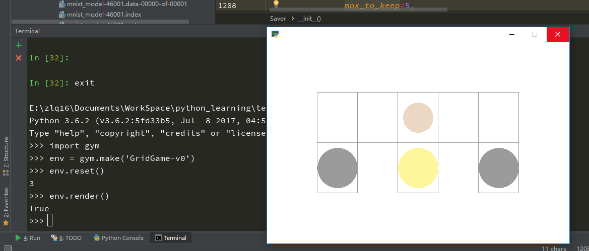

## 使用方法
> 下面的操作最好是在管理员权限下操作
1. 首先找到gym的安装目录，例如我的是`C:\Program Files\Python36\Lib\site-packages\gym`。
---
2. 首先将[core.py](https://github.com/zhuliquan/reinforcement_learning_basic_book/blob/master/1-gym_developing/core.py)
文件拷贝覆盖gym安装目录下面的`core.py`文件。
---
3. 进入到gym安装目录下面的`/envs/classic_control`，将对应的环境文件([grid_game.py](https://github.com/zhuliquan/reinforcement_learning_basic_book/blob/master/1-gym_developing/grid_game.py)和
[maze_game.py](https://github.com/zhuliquan/reinforcement_learning_basic_book/blob/master/1-gym_developing/maze_game.py))拷贝到
拷贝到下面。
---
4. 找到gym安装目录下面的`/envs/classic_control/__init__.py`文件，在后面添加

```python
from gym.envs.classic_control.grid_game import GridEnv
from gym.envs.classic_control.maze_game import MazeEnv
```
---
5. 找到gym安装目录下面的`/envs/__init__.py`文件，在后面添加
```python
register(
	id='GridGame-v0',
	entry_point='gym.envs.classic_control:GridEnv',
	max_episode_steps=200,
	reward_threshold=100.0,
)
register(
	id='MazeGame-v0',
	entry_point='gym.envs.classic_control:MazeEnv',
	max_episode_steps=200,
	reward_threshold=100.0,
)
```
---
6. 验证配置成功
运行下面python代码
```python
import gym
env = gym.make("GridGame-v0")
env.reset()
env.render()
```
如果出现下面的界面说明配置成功
